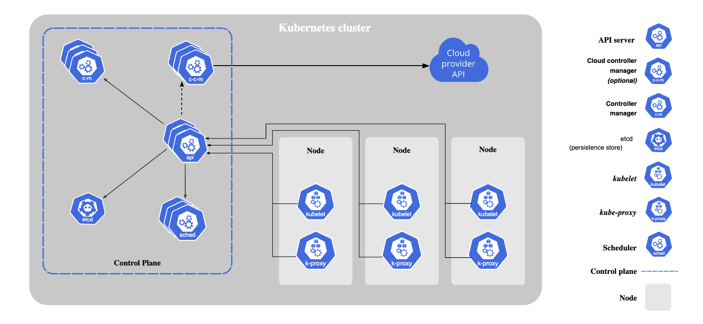

# Kubernetes

This repository contains documentation about Kubernetes components and concepts.

## Key Components:

- [Kubernetes Cluster](./kube_components/cluster/cluster.md): Overview of what a Kubernetes cluster is.

- [Kubernetes Node](./kube_components/node/node.md): Overview of what a Kubernetes node is.

